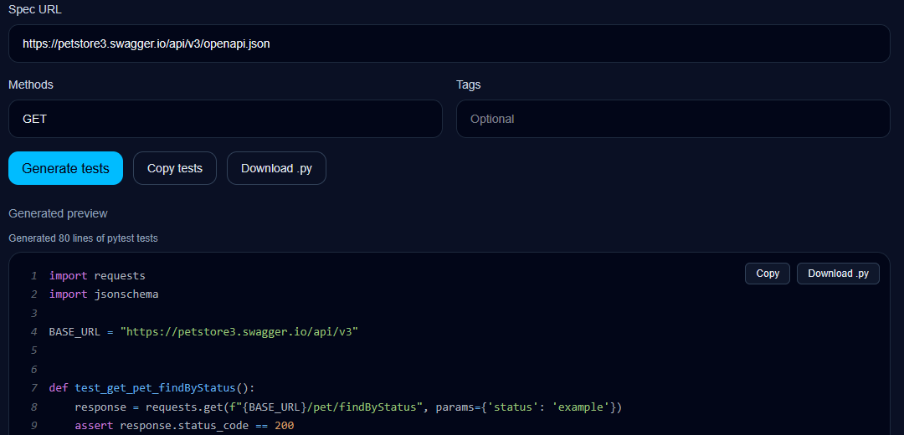
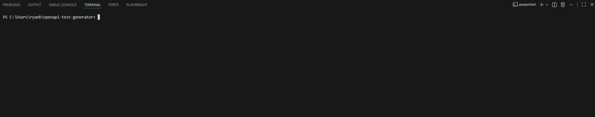

# OpenAPI Test Generator


Generate runnable pytest API tests instantly from an OpenAPI specification.

Paste a spec URL and automatically generate test code with JSON schema validation,
parameter generation, and example payloads.

## Web Demo
https://openapi-test-generator.vercel.app



---

## Demo



---

## Features

OpenAPI Test Generator creates Python API tests from OpenAPI JSON or YAML.

Generated tests can include:

- positive API requests
- negative validation tests
- invalid enum tests
- JSON schema response validation
- path parameter generation
- request body generation
- query parameter generation
- auth header support

---

## Quickstart

Install locally:

```bash
pip install -e .
```

Generate tests from an OpenAPI spec:

```bash
openapi-testgen https://petstore3.swagger.io/api/v3/openapi.json --methods GET
```

Run the generated tests:

```bash
python -m pytest generated/generated_api_tests.py -vv
```

---

## Example

Input OpenAPI spec:

```
https://petstore3.swagger.io/api/v3/openapi.json
```

Generate tests:

```bash
openapi-testgen https://petstore3.swagger.io/api/v3/openapi.json --methods GET
```

Run them:

```bash
pytest generated/generated_api_tests.py
```

---

## Example generated test

```python
import requests
import jsonschema

def test_get_pet_petId():
    response = requests.get(f"{BASE_URL}/pet/1")
    assert response.status_code == 200

    content_type = response.headers.get("Content-Type", "")
    assert "application/json" in content_type

    data = response.json()
    jsonschema.validate(data, schema)
```

---

## CLI Usage

Basic usage:

```bash
openapi-testgen spec.json
```

Custom output file:

```bash
openapi-testgen spec.json --output tests/generated_api_tests.py
```

Filter by HTTP methods:

```bash
openapi-testgen spec.json --methods GET,POST
```

Filter by OpenAPI tags:

```bash
openapi-testgen spec.json --tags Users
```

Set a custom base URL:

```bash
openapi-testgen spec.json --base-url https://api.example.com
```

Use auth headers:

```bash
openapi-testgen spec.json \
  --auth-header-name Authorization \
  --auth-token-env API_TOKEN \
  --auth-scheme Bearer
```

---

## Config file support

You can create an `openapi-testgen.yaml` file to avoid repeating CLI flags.

Example:

```yaml
base_url: https://api.example.com
methods: GET
tags: Users
auth_header_name: Authorization
auth_token_env: API_TOKEN
auth_scheme: Bearer
```

Then run:

```bash
openapi-testgen openapi.json
```

---

## Web Demo

https://openapi-test-generator.vercel.app

The browser demo lets you:

- paste a public OpenAPI spec URL
- preview generated pytest tests
- copy generated code
- download the generated `.py` file
- see exact instructions for running the tests locally

Example demo specs:

- Swagger Petstore
- GitHub REST API description

---

## Project Structure

```
openapi_test_generator/
  cli.py        Command line interface
  parser.py     OpenAPI parsing utilities
  generator.py  Test generation logic

tests/          Unit tests

website/        Next.js frontend

docs/
  demo.gif
```

---

## Why this exists

Writing API tests is repetitive.

If you already have an OpenAPI spec, you already have most of the information needed to generate useful API tests:

- endpoints
- methods
- request bodies
- parameters
- response schemas

This tool turns that information into runnable pytest tests instantly.

---

## Roadmap

Possible future improvements:

- improve generated sample data realism
- add more example APIs
- add GitHub Actions example workflow
- improve generated fixtures/session handling
- expand web demo polish

---

## License

MIT License
